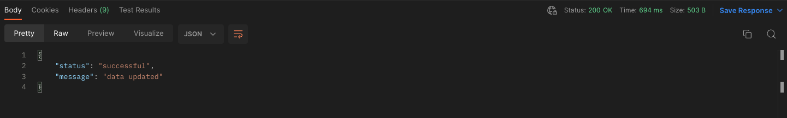

# Digitastic Scraping Test Case

## Case

1. sahibinden sitesi üzerinde kullanıcı tarafından belirlenen kriterlerdeki otomobillerin ilanların listelenmesi
     - config dosyasından veya arguman olarak kullanicidan kriterleri alinabilir (Marka, model, renk, km, vs.)
     - bulunan ilanlar kaydedilecek (ex: json, sql).
  
   Example:

   ```shell
   $ python3 main.py
   Founded 12 advert(s). 
   ```

2. bu sistem python ile yazilmis ve POST methodu olan bir API ile kullaniciya sunulacak.
     - bir POST request ile sahibinden uzerindeki scrap'i başlatacak ve başarılı bir şekilde başlarsa kullanıcıya `success` dönecek.
     - bu endpoint, body icerisinde filtreleri almali:
       - model
       - yil
       - renk
       - vs.
     - kullanicidan mesaj gonderecegi platform icin gerekli bilgileri alacak
     - basarili bir sekilde baslamasi durumunda kullaniciya mail veya mesaj yolu ile buldugu ilanlari gonderecek.

   Example Response:

   
3. yazilan API projesi docker container'i olarak calisabilir hale getirilecek.

   Example Usage:

   ```shell
   $ docker build . -t web-crawler
   [+] Building 1.8s (5/5) FINISHED
   ...
   ```

   ```shell
   $ docker run -it web-crawler
   Running on http://0.0.0.0:5000
   ```

---

NOT: projelendirme kismina ozellikle dikkat edilecektir... (projenizi github linki olarak atiniz.)
